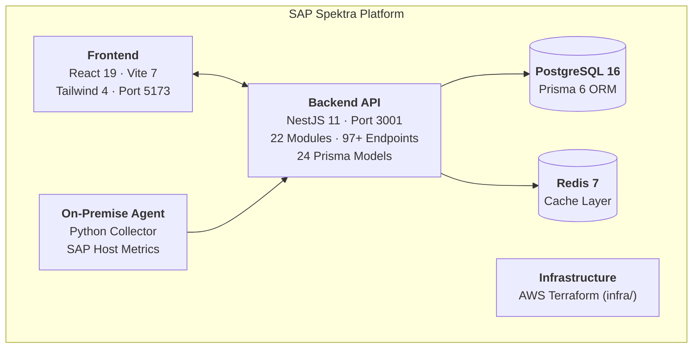
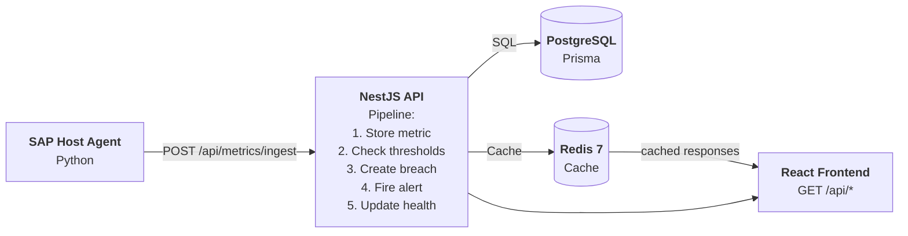
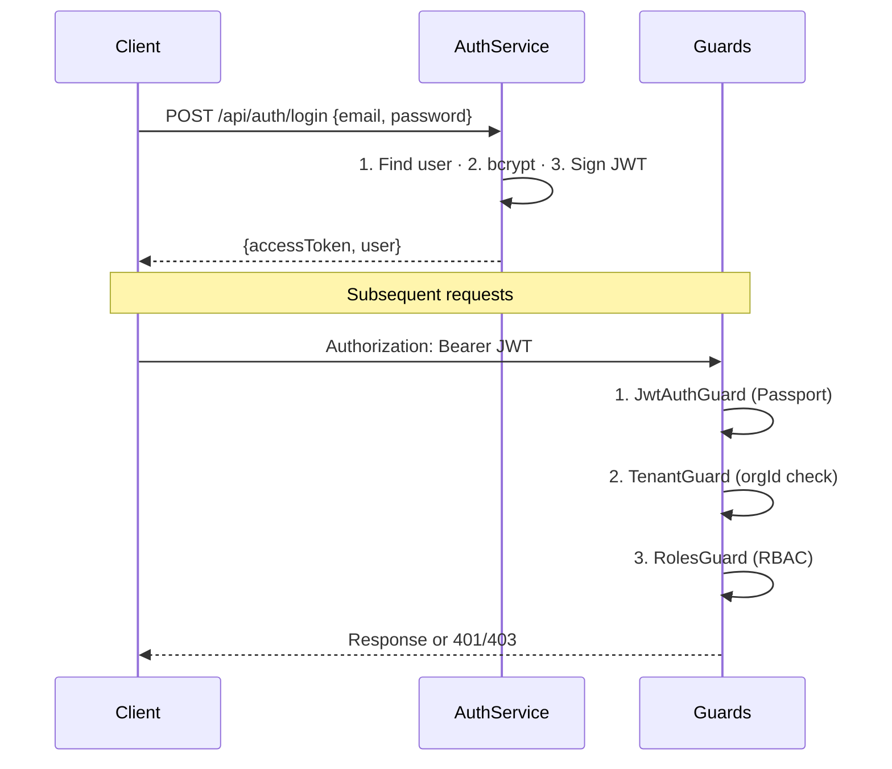
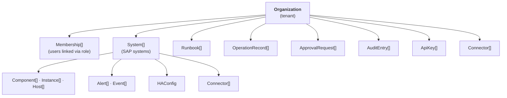
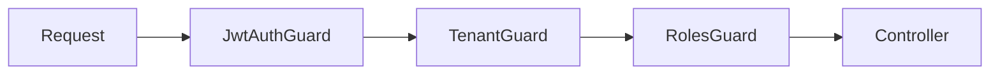

# SAP Spektra — Architecture

## System Overview



## Component Breakdown

### Backend API (`apps/api/`)

| Attribute | Value |
|-----------|-------|
| Framework | NestJS 11 |
| ORM | Prisma 6 |
| Database | PostgreSQL 16 |
| Cache | Redis 7 via `cache-manager-ioredis-yet` |
| Auth | JWT (Passport) + bcryptjs |
| Validation | class-validator + class-transformer |
| Docs | Swagger/OpenAPI at `/api/docs` |
| Port | 3001 |
| Global prefix | `/api` |

22 feature modules, 97+ REST endpoints, 24 Prisma models. The API enforces multi-tenant isolation, role-based access control, rate limiting, and structured audit logging.

### Frontend (`frontend/`)

| Attribute | Value |
|-----------|-------|
| Framework | React 19 |
| Build tool | Vite 7 |
| Styling | Tailwind CSS 4 |
| Port | 5173 (dev) / 80 (Docker) |

Single-page application providing dashboards, system monitoring, runbook management, alert handling, approval workflows, analytics, and settings management.

### Agent (`agent/`)

| Attribute | Value |
|-----------|-------|
| Language | Python |
| Purpose | On-premise SAP host data collector |
| Target Port | 9110 |

Deployed on-premise alongside SAP systems. Collects host-level metrics (CPU, memory, disk, IOPS, network) and pushes them to the API via `POST /api/metrics/ingest`.

### Infrastructure (`infra/`)

| Attribute | Value |
|-----------|-------|
| IaC | Terraform |
| Cloud | AWS |
| Services | S3, SQS, EventBridge, Cognito (AWS_REAL mode) |

Defines cloud infrastructure for production deployments. Used only when `RUNTIME_MODE=AWS_REAL`.

## Data Flow



1. **Agent** collects SAP host metrics and POSTs to `/api/metrics/ingest`
2. **Metrics Pipeline** stores the data point, evaluates thresholds, creates breaches and alerts
3. **Health snapshots** are computed and cached in Redis
4. **Frontend** queries the API which serves from cache or database
5. **Audit entries** are created for all state-changing operations

## Authentication Flow



**JWT Payload:**

```typescript
interface JwtPayload {
  sub: string;           // User ID
  email: string;         // User email
  organizationId: string; // Tenant context
  role: string;          // admin | escalation | operator | viewer
}
```

**LOCAL_SIMULATED mode** uses local JWT signing with `JWT_SECRET`. **AWS_REAL mode** can integrate with AWS Cognito for production authentication.

## Multi-Tenancy Model

Every database query is scoped by `organizationId`, enforced at three levels:

1. **TenantGuard** — validates `organizationId` exists in the JWT payload
2. **@TenantId() decorator** — extracts `organizationId` from the request for use in service methods
3. **Service layer** — every Prisma query includes `where: { organizationId }` as a mandatory filter



Models scoped directly by `organizationId`: System, Alert, Event, ApprovalRequest, Runbook, OperationRecord, AuditEntry, Connector, ApiKey.

Models scoped indirectly via `systemId`: Component, Instance, Host, HostMetric, Dependency, Breach, HealthSnapshot, HAConfig, JobRecord, TransportRecord, CertificateRecord, RunbookExecution, RunbookStepResult, SystemMeta.

## Caching Strategy

| Layer | Technology | TTL | Purpose |
|-------|-----------|-----|---------|
| Application cache | Redis 7 via `@nestjs/cache-manager` | 30s (configurable via `CACHE_TTL`) | Cache frequent reads (dashboard, system lists, analytics) |
| Global module | `CacheModule` (`@Global()`) | Configured per environment | Available to all modules without re-importing |
| URL | `redis://localhost:6379` | — | Default; overridable via `REDIS_URL` |

The cache module is registered globally and uses `cache-manager-ioredis-yet` to connect to Redis. The TTL is configured via the `CACHE_TTL` environment variable (default 30000ms).

## Runtime Modes

| Mode | `RUNTIME_MODE` | Description |
|------|----------------|-------------|
| **LOCAL_SIMULATED** | Default | Local PostgreSQL + Redis, JWT auth with local secret, seeded demo data, no AWS services |
| **AWS_REAL** | Production | AWS Cognito auth, S3 storage, SQS queues, EventBridge events, full cloud infrastructure |

The runtime mode is set via the `RUNTIME_MODE` environment variable. In `LOCAL_SIMULATED` mode, the API runs with a local JWT secret and seeded demo data. In `AWS_REAL` mode, AWS Cognito handles authentication and AWS services are used for storage, queuing, and event processing.

## Directory Structure

```
sap-spektra/
├── apps/api/                    Active backend (NestJS + Prisma)
│   ├── prisma/
│   │   ├── schema.prisma        Database schema (24 models)
│   │   └── migrations/          Prisma migration files
│   ├── src/
│   │   ├── main.ts              Application bootstrap
│   │   ├── app.module.ts        Root module (imports all 22 modules)
│   │   ├── config/
│   │   │   └── configuration.ts Centralized configuration loader
│   │   ├── common/
│   │   │   ├── guards/          JwtAuthGuard, TenantGuard, RolesGuard
│   │   │   ├── decorators/      @Roles, @TenantId, @CurrentUser
│   │   │   ├── filters/         GlobalExceptionFilter
│   │   │   ├── interceptors/    LoggingInterceptor (correlation IDs)
│   │   │   └── dto/             PaginationDto
│   │   ├── domain/
│   │   │   └── enums/           UserRole, AlertLevel, OperationType, etc.
│   │   ├── infrastructure/
│   │   │   ├── prisma/          PrismaModule, PrismaService, seed.ts
│   │   │   └── cache/           CacheModule (Redis via ioredis)
│   │   └── modules/             22 feature modules
│   │       ├── auth/            Login, register, JWT strategy
│   │       ├── health/          Terminus health checks
│   │       ├── dashboard/       Aggregated dashboard data
│   │       ├── users/           User CRUD within tenant
│   │       ├── systems/         SAP system management
│   │       ├── tenants/         Organization management
│   │       ├── alerts/          Alert lifecycle management
│   │       ├── events/          Event log
│   │       ├── approvals/       Approval workflows
│   │       ├── runbooks/        Runbook management & execution
│   │       ├── operations/      Operations, jobs, transports, certs
│   │       ├── metrics/         Host metrics, health, breaches
│   │       ├── ha/              HA/DR configuration & failover
│   │       ├── connectors/      System connector management
│   │       ├── analytics/       Overview, runbook, system analytics
│   │       ├── chat/            AI assistant
│   │       ├── audit/           Audit log
│   │       ├── plans/           Subscription plans (public)
│   │       ├── settings/        Org settings, API key management
│   │       ├── landscape/       Landscape validation
│   │       ├── ai/              AI use cases & responses
│   │       └── licenses/        SAP license information
│   ├── .env.example             Environment variable reference
│   └── package.json             Dependencies & scripts
├── frontend/                    Active frontend (React 19 + Vite 7)
│   ├── src/
│   ├── Dockerfile
│   └── package.json
├── agent/                       On-premise SAP host collector (Python)
├── infra/                       AWS Terraform infrastructure
├── scripts/                     Dev setup & deployment scripts
│   ├── dev-setup.sh             Full local setup
│   └── dev-start.sh             Start API + Frontend
├── docs/                        Project documentation
├── docker-compose.yml           PostgreSQL 16 + Redis 7 + API + Frontend
└── README.md                    Project overview & quick start
```

## Legacy Paths (Deprecated)

| Path | Original Purpose | Status | Replaced By |
|------|-----------------|--------|-------------|
| `lambda/` | Serverless Lambda functions | **DEPRECATED** | `apps/api/` (NestJS monolith) |
| `cfn/` | CloudFormation templates | **DEPRECATED** | `infra/` (Terraform) |
| `setup/` | Mock data server for local dev | **DEPRECATED** | `apps/api/` + `prisma:seed` |

These directories remain in the repository for reference but are no longer used. The project transitioned from a serverless architecture to a NestJS monolith with Prisma ORM.

## Security

### Guard Pipeline

Every authenticated request passes through three guards in sequence:



1. **JwtAuthGuard** — Passport JWT strategy validates the Bearer token and attaches the decoded payload to `request.user`
2. **TenantGuard** — Ensures `organizationId` is present in the JWT payload; rejects with 403 if missing
3. **RolesGuard** — Compares the user's role level against the minimum required role for the endpoint

### RBAC Hierarchy

Roles are hierarchical. A user with a higher role inherits all permissions of lower roles.

| Role | Level | Permissions |
|------|-------|-------------|
| `admin` | 40 | Full access: user management, system registration, failover, settings, audit |
| `escalation` | 30 | Approve/reject requests, all operator permissions |
| `operator` | 20 | Execute runbooks, acknowledge/resolve alerts, create operations, ingest metrics |
| `viewer` | 10 | Read-only access to all resources |

### Rate Limiting

Global rate limit: **100 requests per 60 seconds** (via `@nestjs/throttler`).

Endpoint-specific limits:

| Endpoint | Limit | Window |
|----------|-------|--------|
| `POST /api/auth/login` | 10 | 60s |
| `POST /api/auth/register` | 5 | 60s |
| `POST /api/chat` | 20 | 60s |
| `POST /api/runbooks/:id/execute` | 10 | 60s |
| `POST /api/operations` | 10 | 60s |

### Additional Security Measures

| Measure | Implementation |
|---------|---------------|
| **Helmet** | HTTP security headers (XSS protection, HSTS, Content-Type sniffing, etc.) |
| **CORS** | Configurable origins via `CORS_ORIGIN` (default: `http://localhost:5173`) |
| **Validation** | Global `ValidationPipe` with `whitelist: true` and `forbidNonWhitelisted: true` strips unknown properties |
| **Password hashing** | bcryptjs for password storage |
| **Correlation IDs** | Every request gets a `correlationId` (from `X-Correlation-Id` header or auto-generated UUID) |
| **Structured logging** | JSON-formatted logs with method, URL, status, duration, and correlation ID |
| **Global exception filter** | Catches all unhandled exceptions, logs structured errors, returns safe error responses |
| **Audit trail** | State-changing operations are logged to the `AuditEntry` model |
