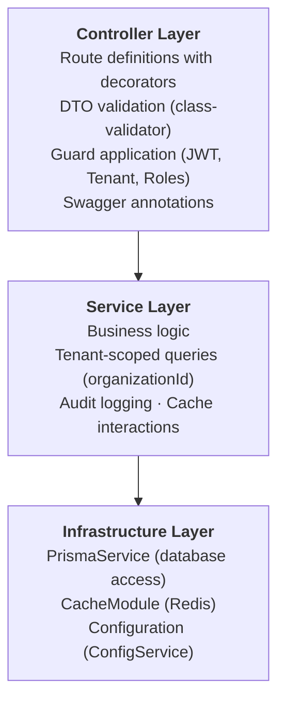

# SAP Spektra — Backend Architecture

## Overview

The backend is a NestJS 11 application located at `apps/api/`. It uses Prisma 6 as the ORM against PostgreSQL 16, Redis 7 for caching, and JWT-based authentication via Passport.

- **Global API prefix:** `/api`
- **Swagger docs:** `http://localhost:3001/api/docs`
- **Global rate limit:** 100 requests per 60 seconds

## NestJS Module Structure

The application is composed of 22 feature modules plus 2 infrastructure modules, all imported in `app.module.ts`.

### Infrastructure Modules

| Module | Path | Purpose |
|--------|------|---------|
| PrismaModule | `infrastructure/prisma/` | Prisma client provider, seed script, health indicator |
| CacheModule | `infrastructure/cache/` | Global Redis cache via `cache-manager-ioredis-yet` |

### Feature Modules

| # | Module | Path | Purpose |
|---|--------|------|---------|
| 1 | AuthModule | `modules/auth/` | Login, registration, JWT strategy, Passport integration |
| 2 | HealthModule | `modules/health/` | Terminus health checks (DB, memory heap, disk) |
| 3 | DashboardModule | `modules/dashboard/` | Aggregated dashboard summary (system counts, alerts, operations) |
| 4 | UsersModule | `modules/users/` | User CRUD within tenant, role assignment |
| 5 | SystemsModule | `modules/systems/` | SAP system registration, update, deletion, health summary |
| 6 | TenantsModule | `modules/tenants/` | Organization details, settings update, tenant stats |
| 7 | AlertsModule | `modules/alerts/` | Alert listing with filters, stats, acknowledge, resolve |
| 8 | EventsModule | `modules/events/` | Event log with filters (level, source, system) |
| 9 | ApprovalsModule | `modules/approvals/` | Approval request lifecycle (create, approve, reject) |
| 10 | RunbooksModule | `modules/runbooks/` | Runbook listing, execution with dry-run, compatibility validation |
| 11 | OperationsModule | `modules/operations/` | Operations scheduling, job/transport/certificate records |
| 12 | AuditModule | `modules/audit/` | Audit log entries with severity and action filters |
| 13 | ConnectorsModule | `modules/connectors/` | System connector management, heartbeat, connectivity validation |
| 14 | HAModule | `modules/ha/` | HA/DR configuration, failover trigger, prerequisites, drivers |
| 15 | MetricsModule | `modules/metrics/` | Host metrics ingestion, health snapshots, breaches, dependencies |
| 16 | AnalyticsModule | `modules/analytics/` | Overview analytics, runbook execution analytics, system trends |
| 17 | ChatModule | `modules/chat/` | AI assistant for SAP operations guidance |
| 18 | PlansModule | `modules/plans/` | Subscription plan listing (public, no auth required) |
| 19 | SettingsModule | `modules/settings/` | Organization settings, API key CRUD |
| 20 | LandscapeModule | `modules/landscape/` | Landscape validation checks across all systems |
| 21 | AiModule | `modules/ai/` | AI use cases and generated responses/insights |
| 22 | LicensesModule | `modules/licenses/` | SAP license information for all systems |

## Clean Architecture Layers



Each module follows the pattern:
- `*.module.ts` — Module declaration with imports, controllers, providers
- `*.controller.ts` — Route handlers with guards and decorators
- `*.service.ts` — Business logic with Prisma queries
- `dto/*.dto.ts` — Request/response validation classes

## Guards

### JwtAuthGuard

```typescript
// common/guards/jwt-auth.guard.ts
@Injectable()
export class JwtAuthGuard extends AuthGuard('jwt') {}
```

Extends Passport's `AuthGuard('jwt')`. Validates the Bearer token from the `Authorization` header and attaches the decoded `JwtPayload` to `request.user`.

### TenantGuard

```typescript
// common/guards/tenant.guard.ts
@Injectable()
export class TenantGuard implements CanActivate {
  canActivate(context: ExecutionContext): boolean {
    const user = request.user as JwtPayload;
    if (!user?.organizationId) {
      throw new ForbiddenException('No tenant context');
    }
    return true;
  }
}
```

Ensures every authenticated request has an `organizationId` in the JWT payload. Without this, the request is rejected with a 403.

### RolesGuard

```typescript
// common/guards/roles.guard.ts
@Injectable()
export class RolesGuard implements CanActivate {
  canActivate(context: ExecutionContext): boolean {
    // Reads @Roles() metadata from handler/class
    // Compares user's ROLE_HIERARCHY level against minimum required
    // Higher role level = more permissions (admin=40 > escalation=30 > operator=20 > viewer=10)
  }
}
```

Role hierarchy (numeric levels):

| Role | Level | Inherits |
|------|-------|----------|
| `admin` | 40 | All roles |
| `escalation` | 30 | operator, viewer |
| `operator` | 20 | viewer |
| `viewer` | 10 | None |

A user with `admin` (level 40) can access any endpoint requiring `viewer` (level 10) or higher, because `40 >= 10`.

## Custom Decorators

### @Roles(...roles: string[])

```typescript
// common/decorators/roles.decorator.ts
export const ROLES_KEY = 'roles';
export const Roles = (...roles: string[]) => SetMetadata(ROLES_KEY, roles);
```

Sets the minimum required role(s) for an endpoint. Used by `RolesGuard`.

```typescript
@Roles('operator')  // Requires operator (level 20) or higher
@Roles('admin')     // Requires admin (level 40) only
```

### @TenantId()

```typescript
// common/decorators/tenant.decorator.ts
export const TenantId = createParamDecorator(
  (_data, ctx) => ctx.switchToHttp().getRequest().user.organizationId
);
```

Extracts `organizationId` from the JWT payload. Used in every controller method to scope queries to the current tenant.

### @CurrentUser()

```typescript
// common/decorators/current-user.decorator.ts
export interface JwtPayload {
  sub: string;           // User ID
  email: string;
  organizationId: string;
  role: string;
}

export const CurrentUser = createParamDecorator(
  (data: keyof JwtPayload | undefined, ctx) => {
    const user = ctx.switchToHttp().getRequest().user as JwtPayload;
    return data ? user[data] : user;
  }
);
```

Extracts the full user payload or a specific field from the JWT.

## DTO Validation

All incoming request bodies and query parameters are validated using `class-validator` with a global `ValidationPipe`:

```typescript
app.useGlobalPipes(new ValidationPipe({
  whitelist: true,              // Strip properties not in DTO
  forbidNonWhitelisted: true,   // Reject requests with unknown properties
  transform: true,              // Auto-transform to DTO class instances
  transformOptions: { enableImplicitConversion: true },
}));
```

### Key DTOs

| DTO | Module | Validators |
|-----|--------|-----------|
| `LoginDto` | Auth | `@IsEmail()`, `@IsString()`, `@MinLength(6)` |
| `RegisterDto` | Auth | `@IsEmail()`, `@IsString()`, `@MinLength(6)` |
| `CreateSystemDto` | Systems | `@Length(3,3)` for SID, `@IsIn(SAP_PRODUCTS)`, `@IsEnum(SapEnvironment)` |
| `UpdateSystemDto` | Systems | All fields `@IsOptional()` |
| `CreateUserDto` | Users | `@IsEmail()`, `@MinLength(6)`, `@IsIn(['viewer','operator','escalation','admin'])` |
| `UpdateUserDto` | Users | `@IsOptional()` fields for name, role, status |
| `AlertFiltersDto` | Alerts | `@IsIn(['active','acknowledged','resolved'])`, `@IsIn(['info','warning','critical'])` |
| `ResolveAlertDto` | Alerts | Optional category and note strings |
| `EventFiltersDto` | Events | Optional level, source, systemId, limit |
| `CreateApprovalDto` | Approvals | `@IsIn(['low','medium','high','critical'])` for severity |
| `ApprovalFiltersDto` | Approvals | Optional status and systemId |
| `ExecuteRunbookDto` | Runbooks | systemId (required), dryRun (optional boolean) |
| `CreateOperationDto` | Operations | systemId, type, description required; riskLevel, scheduledTime, schedule optional |
| `UpdateOperationStatusDto` | Operations | `@IsEnum(OperationStatus)` |
| `OperationFiltersDto` | Operations | Optional status, type, systemId |
| `UpdateHAStatusDto` | HA | Status string |
| `ChatMessageDto` | Chat | Message string with optional context |
| `UpdateTenantDto` | Tenants | Organization setting fields |
| `UpdateSettingsDto` | Settings | Organization settings |
| `CreateApiKeyDto` | Settings | API key name |
| `AuditFiltersDto` | Audit | Optional severity, action, limit |
| `MetricsHoursQueryDto` | Metrics | Hours parameter (clamped 1-8760, default 24) |
| `BreachesQueryDto` | Metrics | Optional systemId, resolved filter |
| `SystemMetaQueryDto` | Metrics | Optional systemId |
| `SystemTrendsQueryDto` | Analytics | Optional days parameter (default 7) |

## Rate Limiting

Global limit applied via `ThrottlerModule`:

```typescript
ThrottlerModule.forRoot([{ ttl: 60000, limit: 100 }])
```

The `ThrottlerGuard` is registered as a global `APP_GUARD`.

Endpoint-specific overrides using `@Throttle()`:

| Endpoint | Limit | Window | Reason |
|----------|-------|--------|--------|
| `POST /api/auth/login` | 10 req | 60s | Brute-force protection |
| `POST /api/auth/register` | 5 req | 60s | Abuse prevention |
| `POST /api/chat` | 20 req | 60s | AI resource management |
| `POST /api/runbooks/:id/execute` | 10 req | 60s | Execution rate control |
| `POST /api/operations` | 10 req | 60s | Operation scheduling control |

## Error Handling

### GlobalExceptionFilter

```typescript
// common/filters/http-exception.filter.ts
@Catch()
export class GlobalExceptionFilter implements ExceptionFilter {
  catch(exception: unknown, host: ArgumentsHost): void {
    // 1. Extract HTTP status (500 for non-HttpException)
    // 2. Log structured JSON with correlationId
    // 3. Return standardized error response
  }
}
```

Standard error response format:

```json
{
  "statusCode": 403,
  "message": "Insufficient role privileges",
  "correlationId": "uuid-v4",
  "timestamp": "2026-03-17T12:00:00.000Z",
  "path": "/api/systems"
}
```

Errors with status >= 500 are logged as `error` with stack traces. Errors with status < 500 are logged as `warn`.

### LoggingInterceptor

Every request/response is logged as structured JSON with:
- Correlation ID (from `X-Correlation-Id` header or auto-generated UUID)
- HTTP method and URL
- Response status code
- Duration in milliseconds
- User agent (truncated to 80 chars)

## Audit Logging

State-changing operations create entries in the `AuditEntry` model:

```
AuditEntry {
  organizationId  — Tenant scope
  userId          — Actor (nullable)
  userEmail       — Actor email
  action          — "system.register", "approval.approve", etc.
  resource        — Affected resource identifier
  details         — Additional context
  severity        — "info" | "warning" | "critical"
  timestamp       — When the action occurred
}
```

## API Conventions

- **Protocol:** REST over HTTP
- **Format:** JSON request/response bodies
- **Prefix:** All endpoints prefixed with `/api`
- **Auth:** Bearer JWT token in `Authorization` header
- **Swagger:** Full OpenAPI documentation at `/api/docs`
- **CRUD naming:** `GET /` (list), `GET /:id` (get), `POST /` (create), `PATCH /:id` (update), `DELETE /:id` (delete)
- **Pagination:** Via query parameters (limit, offset) where applicable
- **Filtering:** Via query parameters specific to each resource

## All 97+ Endpoints by Controller

### Auth (`/api/auth`) — No tenant guard

| # | Method | Path | Role | Description |
|---|--------|------|------|-------------|
| 1 | POST | `/api/auth/login` | Public | Login with email and password (rate: 10/min) |
| 2 | POST | `/api/auth/register` | Public | Register new user and organization (rate: 5/min) |
| 3 | GET | `/api/auth/me` | Any (JWT) | Get current user profile |

### Health (`/api/health`) — No auth

| # | Method | Path | Role | Description |
|---|--------|------|------|-------------|
| 4 | GET | `/api/health` | Public | Health check (DB, memory, disk) |
| 5 | GET | `/api/health/liveness` | Public | Liveness probe |

### Plans (`/api/plans`) — No auth

| # | Method | Path | Role | Description |
|---|--------|------|------|-------------|
| 6 | GET | `/api/plans` | Public | List all available plans |
| 7 | GET | `/api/plans/:tier` | Public | Get plan by tier |

### Dashboard (`/api/dashboard`)

| # | Method | Path | Role | Description |
|---|--------|------|------|-------------|
| 8 | GET | `/api/dashboard` | viewer | Get dashboard summary |

### Systems (`/api/systems`)

| # | Method | Path | Role | Description |
|---|--------|------|------|-------------|
| 9 | GET | `/api/systems` | viewer | List all SAP systems |
| 10 | GET | `/api/systems/health-summary` | viewer | Get health summary for all systems |
| 11 | GET | `/api/systems/:id` | viewer | Get system by ID with full details |
| 12 | POST | `/api/systems` | admin | Register a new SAP system |
| 13 | PATCH | `/api/systems/:id` | operator | Update system configuration |
| 14 | DELETE | `/api/systems/:id` | admin | Deregister a system |

### Metrics (`/api/metrics`)

| # | Method | Path | Role | Description |
|---|--------|------|------|-------------|
| 15 | POST | `/api/metrics/ingest` | operator | Ingest metric data point from agent |
| 16 | GET | `/api/metrics/hosts/:hostId` | viewer | Get host metrics time-series |
| 17 | GET | `/api/metrics/systems/:systemId/hosts` | viewer | Get all host metrics for a system |
| 18 | GET | `/api/metrics/systems/:systemId/health` | viewer | Get health snapshots for a system |
| 19 | GET | `/api/metrics/breaches` | viewer | List threshold breaches |
| 20 | GET | `/api/metrics/systems/:systemId/dependencies` | viewer | Get system dependencies |
| 21 | GET | `/api/metrics/systems/:systemId/hosts-detail` | viewer | Get hosts with instances for a system |
| 22 | GET | `/api/metrics/systems/:systemId/components` | viewer | Get components with instances for a system |
| 23 | GET | `/api/metrics/system-meta` | viewer | Get system meta (all or by systemId) |

### Alerts (`/api/alerts`)

| # | Method | Path | Role | Description |
|---|--------|------|------|-------------|
| 24 | GET | `/api/alerts` | viewer | List alerts with optional filters |
| 25 | GET | `/api/alerts/stats` | viewer | Get alert statistics |
| 26 | PATCH | `/api/alerts/:id/acknowledge` | operator | Acknowledge an alert |
| 27 | PATCH | `/api/alerts/:id/resolve` | operator | Resolve an alert |

### Events (`/api/events`)

| # | Method | Path | Role | Description |
|---|--------|------|------|-------------|
| 28 | GET | `/api/events` | viewer | List events with optional filters |

### Approvals (`/api/approvals`)

| # | Method | Path | Role | Description |
|---|--------|------|------|-------------|
| 29 | GET | `/api/approvals` | viewer | List approval requests |
| 30 | GET | `/api/approvals/:id` | viewer | Get approval request by ID |
| 31 | POST | `/api/approvals` | operator | Create an approval request |
| 32 | PATCH | `/api/approvals/:id/approve` | escalation | Approve a request |
| 33 | PATCH | `/api/approvals/:id/reject` | escalation | Reject a request |

### Runbooks (`/api/runbooks`)

| # | Method | Path | Role | Description |
|---|--------|------|------|-------------|
| 34 | GET | `/api/runbooks` | viewer | List all runbooks (optional category filter) |
| 35 | GET | `/api/runbooks/executions` | viewer | List all runbook executions |
| 36 | GET | `/api/runbooks/executions/:executionId` | viewer | Get execution detail with step results |
| 37 | GET | `/api/runbooks/:id` | viewer | Get runbook by ID |
| 38 | POST | `/api/runbooks/:id/execute` | operator | Execute a runbook on a system (rate: 10/min) |

### Operations (`/api/operations`)

| # | Method | Path | Role | Description |
|---|--------|------|------|-------------|
| 39 | GET | `/api/operations` | viewer | List operations with filters |
| 40 | POST | `/api/operations` | operator | Schedule a new operation (rate: 10/min) |
| 41 | PATCH | `/api/operations/:id/status` | operator | Update operation status |
| 42 | GET | `/api/operations/jobs` | viewer | List background job records |
| 43 | GET | `/api/operations/transports` | viewer | List transport records |
| 44 | GET | `/api/operations/certificates` | viewer | List certificate records |

### HA/DR (`/api/ha`)

| # | Method | Path | Role | Description |
|---|--------|------|------|-------------|
| 45 | GET | `/api/ha` | viewer | List all HA configurations |
| 46 | GET | `/api/ha/:systemId` | viewer | Get HA config for a system |
| 47 | PATCH | `/api/ha/:systemId/failover` | admin | Trigger failover for a system |
| 48 | PATCH | `/api/ha/:systemId/status` | operator | Update HA status |
| 49 | GET | `/api/ha/:systemId/prereqs` | viewer | Get HA prerequisites checklist |
| 50 | GET | `/api/ha/:systemId/ops-history` | viewer | Get HA operations history |
| 51 | GET | `/api/ha/:systemId/drivers` | viewer | Get HA driver information |

### Chat (`/api/chat`)

| # | Method | Path | Role | Description |
|---|--------|------|------|-------------|
| 52 | POST | `/api/chat` | viewer | Send a message to the AI assistant (rate: 20/min) |

### Analytics (`/api/analytics`)

| # | Method | Path | Role | Description |
|---|--------|------|------|-------------|
| 53 | GET | `/api/analytics/overview` | viewer | Get analytics overview |
| 54 | GET | `/api/analytics/runbooks` | viewer | Get runbook execution analytics |
| 55 | GET | `/api/analytics/systems/:systemId/trends` | viewer | Get system health trends |

### Connectors (`/api/connectors`)

| # | Method | Path | Role | Description |
|---|--------|------|------|-------------|
| 56 | GET | `/api/connectors` | viewer | List all connectors |
| 57 | GET | `/api/connectors/:id` | viewer | Get connector by ID |
| 58 | PATCH | `/api/connectors/:id/heartbeat` | operator | Update connector heartbeat |
| 59 | GET | `/api/connectors/validate/all` | operator | Validate connectivity of all connectors |
| 60 | GET | `/api/connectors/:id/validate` | operator | Validate a specific connector |

### Users (`/api/users`)

| # | Method | Path | Role | Description |
|---|--------|------|------|-------------|
| 61 | GET | `/api/users` | viewer | List all users in the organization |
| 62 | GET | `/api/users/:id` | viewer | Get user by ID |
| 63 | POST | `/api/users` | admin | Create or invite a user |
| 64 | PATCH | `/api/users/:id` | admin | Update user role or status |
| 65 | DELETE | `/api/users/:id` | admin | Remove user from organization |

### Tenant (`/api/tenant`)

| # | Method | Path | Role | Description |
|---|--------|------|------|-------------|
| 66 | GET | `/api/tenant` | viewer | Get current organization details |
| 67 | PATCH | `/api/tenant` | admin | Update organization settings |
| 68 | GET | `/api/tenant/stats` | viewer | Get organization statistics |

### Settings (`/api/settings`)

| # | Method | Path | Role | Description |
|---|--------|------|------|-------------|
| 69 | GET | `/api/settings` | admin | Get organization settings |
| 70 | PATCH | `/api/settings` | admin | Update organization settings |
| 71 | GET | `/api/settings/api-keys` | admin | List API keys |
| 72 | POST | `/api/settings/api-keys` | admin | Create a new API key |
| 73 | PATCH | `/api/settings/api-keys/:id/revoke` | admin | Revoke an API key |

### Audit (`/api/audit`)

| # | Method | Path | Role | Description |
|---|--------|------|------|-------------|
| 74 | GET | `/api/audit` | admin | List audit log entries |

### Landscape (`/api/landscape`)

| # | Method | Path | Role | Description |
|---|--------|------|------|-------------|
| 75 | GET | `/api/landscape/validation` | viewer | Get landscape validation checks for all systems |

### AI (`/api/ai`)

| # | Method | Path | Role | Description |
|---|--------|------|------|-------------|
| 76 | GET | `/api/ai/use-cases` | viewer | Get available AI use cases |
| 77 | GET | `/api/ai/responses` | viewer | Get recent AI-generated responses and insights |

### Licenses (`/api/licenses`)

| # | Method | Path | Role | Description |
|---|--------|------|------|-------------|
| 78 | GET | `/api/licenses` | viewer | Get license information for all systems |

> **Note:** The 97+ endpoint count includes additional endpoints exposed by service methods, sub-routes, and dynamic parameter combinations beyond the core 78 route definitions listed above. The exact count varies as new features are added.

## Environment Variables

Complete list with defaults. Set in `.env` (copy from `.env.example`).

### Core

| Variable | Default | Description |
|----------|---------|-------------|
| `RUNTIME_MODE` | `LOCAL_SIMULATED` | Runtime mode: `LOCAL_SIMULATED` or `AWS_REAL` |
| `PORT` | `3001` | API server port |
| `NODE_ENV` | `development` | Node.js environment |

### Database

| Variable | Default | Description |
|----------|---------|-------------|
| `DATABASE_URL` | *(required)* | PostgreSQL connection string |

### Redis

| Variable | Default | Description |
|----------|---------|-------------|
| `REDIS_URL` | `redis://localhost:6379` | Redis connection URL |
| `CACHE_TTL` | `30000` | Cache TTL in milliseconds |

### Authentication

| Variable | Default | Description |
|----------|---------|-------------|
| `JWT_SECRET` | `spektra-dev-secret` (dev only) | JWT signing secret (**required in production**) |
| `JWT_EXPIRATION` | `24h` | Access token expiration |
| `JWT_REFRESH_EXPIRATION` | `7d` | Refresh token expiration |

### AWS Cognito (AWS_REAL mode only)

| Variable | Default | Description |
|----------|---------|-------------|
| `COGNITO_REGION` | `us-east-1` | AWS Cognito region |
| `COGNITO_USER_POOL_ID` | *(empty)* | Cognito User Pool ID |
| `COGNITO_CLIENT_ID` | *(empty)* | Cognito Client ID |

### AWS Services (AWS_REAL mode only)

| Variable | Default | Description |
|----------|---------|-------------|
| `AWS_REGION` | `us-east-1` | AWS region |
| `S3_BUCKET` | *(empty)* | S3 bucket name |
| `SQS_QUEUE_URL` | *(empty)* | SQS queue URL |
| `EVENTBRIDGE_BUS` | *(empty)* | EventBridge bus name |

### Logging & CORS

| Variable | Default | Description |
|----------|---------|-------------|
| `LOG_LEVEL` | `debug` | Log level |
| `CORS_ORIGIN` | `http://localhost:5173,http://localhost:5174` | Comma-separated allowed origins |

### Seed & Agent

| Variable | Default | Description |
|----------|---------|-------------|
| `SEED_SCENARIO` | `mixed-landscape-demo` | Seed scenario for LOCAL_SIMULATED mode |
| `DEMO_API_KEY` | *(empty)* | Demo API key for seeding |
| `SPEKTRA_AGENT_URL` | `http://localhost:9110` | Spektra Agent URL |

### Operation Timeouts

| Variable | Default | Description |
|----------|---------|-------------|
| `OPERATION_TIMEOUT_MS` | `120000` | Operation timeout in milliseconds |
| `OPERATION_TIMEOUT_S` | `120` | Operation timeout in seconds |
