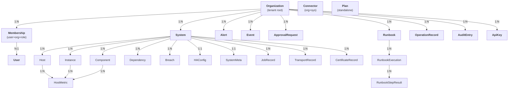

# SAP Spektra — Domain Model

## Entity Relationship Diagram



## Prisma Models — Complete Reference

### Organization

Tenant root entity. All data is scoped to an organization.

| Field | Type | Default | Constraints | Description |
|-------|------|---------|-------------|-------------|
| `id` | String | `uuid()` | `@id` | Primary key |
| `name` | String | — | Required | Organization display name |
| `slug` | String | — | `@unique` | URL-safe identifier |
| `plan` | String | `"professional"` | — | Plan tier: starter, professional, enterprise |
| `logo` | String? | — | Optional | Logo URL |
| `timezone` | String | `"America/Bogota"` | — | IANA timezone |
| `language` | String | `"es"` | — | Language code |
| `settings` | Json | `"{}"` | — | Flexible settings JSON |
| `limits` | Json | `"{}"` | — | Plan-enforced limits JSON |
| `createdAt` | DateTime | `now()` | — | Creation timestamp |
| `updatedAt` | DateTime | `@updatedAt` | — | Last update timestamp |

**Relations:** Membership[], System[], Alert[], Event[], ApprovalRequest[], Runbook[], OperationRecord[], AuditEntry[], Connector[], ApiKey[]

**Table:** `organizations`

---

### User

User account. A user can belong to multiple organizations via Membership.

| Field | Type | Default | Constraints | Description |
|-------|------|---------|-------------|-------------|
| `id` | String | `uuid()` | `@id` | Primary key |
| `email` | String | — | `@unique` | Login email |
| `name` | String | — | Required | Display name |
| `passwordHash` | String | — | Required | bcrypt-hashed password |
| `status` | String | `"active"` | — | active, invited, disabled |
| `mfaEnabled` | Boolean | `false` | — | MFA enrollment flag |
| `lastLoginAt` | DateTime? | — | Optional | Last login timestamp |
| `createdAt` | DateTime | `now()` | — | Creation timestamp |
| `updatedAt` | DateTime | `@updatedAt` | — | Last update timestamp |

**Relations:** Membership[]

**Table:** `users`

---

### Membership

Join table linking users to organizations with a role.

| Field | Type | Default | Constraints | Description |
|-------|------|---------|-------------|-------------|
| `id` | String | `uuid()` | `@id` | Primary key |
| `userId` | String | — | FK → User | User reference |
| `organizationId` | String | — | FK → Organization | Org reference |
| `role` | String | `"viewer"` | — | admin, escalation, operator, viewer |
| `createdAt` | DateTime | `now()` | — | Creation timestamp |
| `updatedAt` | DateTime | `@updatedAt` | — | Last update timestamp |

**Unique:** `@@unique([userId, organizationId])` — a user can have only one role per organization

**Cascade:** Deleting a User or Organization cascades to delete the Membership.

**Table:** `memberships`

---

### Plan

Subscription plan definition. Standalone (not organization-scoped).

| Field | Type | Default | Constraints | Description |
|-------|------|---------|-------------|-------------|
| `id` | String | `uuid()` | `@id` | Primary key |
| `tier` | String | — | `@unique` | starter, professional, enterprise |
| `name` | String | — | Required | Display name |
| `price` | Int | `0` | — | Monthly price in cents |
| `features` | Json | `"[]"` | — | String array of feature keys |
| `limits` | Json | `"{}"` | — | `{ maxSystems, maxUsers, ... }` |
| `createdAt` | DateTime | `now()` | — | Creation timestamp |

**Table:** `plans`

---

### System

SAP system registered within a tenant.

| Field | Type | Default | Constraints | Description |
|-------|------|---------|-------------|-------------|
| `id` | String | `uuid()` | `@id` | Primary key |
| `organizationId` | String | — | FK → Organization | Tenant scope |
| `sid` | String | — | Required | 3-character SAP System ID |
| `description` | String | — | Required | Human-readable description |
| `sapProduct` | String | — | Required | S/4HANA, ECC, BW/4HANA, SolMan, PO, etc. |
| `productFamily` | String | — | Required | ABAP_BUSINESS_SUITE, JAVA_STACK, EDGE, etc. |
| `sapStackType` | String | — | Required | ABAP, JAVA, DUAL_STACK, EDGE, DB, MANAGED_CLOUD_RESTRICTED |
| `dbType` | String | — | Required | SAP HANA 2.0, Oracle 19c, IBM DB2, MSSQL, MaxDB, etc. |
| `environment` | String | — | Required | PRD, QAS, DEV, SBX, DR |
| `mode` | String | `"PRODUCTION"` | — | PRODUCTION, TRIAL, MAINTENANCE |
| `deploymentModel` | String | `"ON_PREMISE"` | — | ON_PREMISE, RISE_MANAGED, AWS_HOSTED, etc. |
| `connectionMode` | String | `"AGENT_FULL"` | — | AGENT_FULL, MANAGED_RESTRICTED, CLOUD_CONNECTOR, etc. |
| `monitoringCapabilityProfile` | String | `"FULL_STACK_AGENT"` | — | FULL_STACK_AGENT, RISE_RESTRICTED, etc. |
| `supportsHostMetrics` | Boolean | `true` | — | Host metric support flag |
| `supportsOsMetrics` | Boolean | `true` | — | OS metric support flag |
| `supportsSapMetrics` | Boolean | `true` | — | SAP metric support flag |
| `supportsDbMetrics` | Boolean | `true` | — | DB metric support flag |
| `supportsTopologyDiscovery` | Boolean | `true` | — | Topology discovery support |
| `supportsRunbookExecution` | Boolean | `true` | — | Runbook execution support |
| `supportsApprovals` | Boolean | `true` | — | Approval workflow support |
| `integrationTrustLevel` | String | `"full"` | — | full, partial, restricted |
| `healthScore` | Int | `0` | — | Health score 0-100 |
| `status` | String | `"healthy"` | — | healthy, warning, degraded, critical, unreachable |
| `lastCheckAt` | DateTime? | — | Optional | Last health check timestamp |
| `createdAt` | DateTime | `now()` | — | Creation timestamp |
| `updatedAt` | DateTime | `@updatedAt` | — | Last update timestamp |

**Unique:** `@@unique([organizationId, sid])` — SID must be unique within an organization

**Indexes:** `@@index([organizationId])`

**Cascade:** Deleting an Organization cascades to delete all Systems.

**Relations:** Component[], Instance[], Host[], Dependency[], Breach[], HealthSnapshot[], Alert[], Event[], ApprovalRequest[], OperationRecord[], Connector[], HAConfig?, SystemMeta?, JobRecord[], TransportRecord[], CertificateRecord[], RunbookExecution[]

**Table:** `systems`

---

### SystemMeta

Extended metadata for a system. One-to-one with System.

| Field | Type | Default | Constraints | Description |
|-------|------|---------|-------------|-------------|
| `id` | String | `uuid()` | `@id` | Primary key |
| `systemId` | String | — | `@unique`, FK → System | System reference |
| `sapRelease` | String? | — | Optional | SAP release version |
| `kernelVersion` | String? | — | Optional | Kernel version |
| `kernelPatch` | String? | — | Optional | Kernel patch level |
| `abapPatch` | String? | — | Optional | ABAP patch level |
| `client` | String? | — | Optional | SAP client number |
| `osVersion` | String? | — | Optional | Operating system version |
| `dbVersion` | String? | — | Optional | Database version |
| `notes` | String? | — | Optional | Free-text notes |

**Cascade:** Deleting a System cascades to delete SystemMeta.

**Table:** `system_meta`

---

### Component

SAP software component within a system.

| Field | Type | Default | Constraints | Description |
|-------|------|---------|-------------|-------------|
| `id` | String | `uuid()` | `@id` | Primary key |
| `systemId` | String | — | FK → System | System reference |
| `name` | String | — | Required | Component name |
| `type` | String | — | Required | ABAP, JAVA, DB, WEBDISP, GATEWAY, etc. |
| `version` | String? | — | Optional | Component version |
| `status` | String | `"active"` | — | Component status |

**Indexes:** `@@index([systemId])`

**Cascade:** Deleting a System cascades to delete Components.

**Relations:** Instance[]

**Table:** `components`

---

### Instance

SAP application instance running on a host.

| Field | Type | Default | Constraints | Description |
|-------|------|---------|-------------|-------------|
| `id` | String | `uuid()` | `@id` | Primary key |
| `systemId` | String | — | FK → System | System reference |
| `componentId` | String? | — | FK → Component (optional) | Component reference |
| `hostId` | String? | — | FK → Host (optional) | Host reference |
| `instanceNr` | String | — | Required | Instance number (00, 01, etc.) |
| `type` | String | — | Required | PAS, AAS, ASCS, ERS, HANA, WEBDISP, etc. |
| `role` | String | — | Required | Dialog, Batch, Gateway, Web Dispatcher, etc. |
| `status` | String | `"active"` | — | Instance status |
| `features` | Json | `"{}"` | — | SAP features enabled |

**Indexes:** `@@index([systemId])`, `@@index([componentId])`, `@@index([hostId])`

**Cascade:** Deleting System, Component, or Host cascades to delete Instances.

**Table:** `instances`

---

### Host

Physical or virtual host running SAP instances.

| Field | Type | Default | Constraints | Description |
|-------|------|---------|-------------|-------------|
| `id` | String | `uuid()` | `@id` | Primary key |
| `systemId` | String | — | FK → System | System reference |
| `hostname` | String | — | Required | Hostname |
| `ip` | String? | — | Optional | IP address |
| `os` | String? | — | Optional | Operating system |
| `osVersion` | String? | — | Optional | OS version |
| `region` | String? | — | Optional | Cloud region |
| `zone` | String? | — | Optional | Availability zone |
| `cpu` | Float | `0` | — | Current CPU utilization |
| `memory` | Float | `0` | — | Current memory utilization |
| `disk` | Float | `0` | — | Current disk utilization |
| `status` | String | `"active"` | — | Host status |

**Indexes:** `@@index([systemId])`

**Cascade:** Deleting a System cascades to delete Hosts.

**Relations:** Instance[], HostMetric[]

**Table:** `hosts`

---

### HostMetric

Time-series metric data point for a host.

| Field | Type | Default | Constraints | Description |
|-------|------|---------|-------------|-------------|
| `id` | String | `uuid()` | `@id` | Primary key |
| `hostId` | String | — | FK → Host | Host reference |
| `timestamp` | DateTime | `now()` | — | Measurement timestamp |
| `cpu` | Float | — | Required | CPU utilization percentage |
| `memory` | Float | — | Required | Memory utilization percentage |
| `disk` | Float | — | Required | Disk utilization percentage |
| `iops` | Float? | — | Optional | I/O operations per second |
| `networkIn` | Float? | — | Optional | Network ingress (bytes/s) |
| `networkOut` | Float? | — | Optional | Network egress (bytes/s) |

**Indexes:** `@@index([hostId, timestamp])`

**Cascade:** Deleting a Host cascades to delete HostMetrics.

**Table:** `host_metrics`

---

### Dependency

System dependency (RFC, HTTP, IDoc connections, etc.).

| Field | Type | Default | Constraints | Description |
|-------|------|---------|-------------|-------------|
| `id` | String | `uuid()` | `@id` | Primary key |
| `systemId` | String | — | FK → System | System reference |
| `name` | String | — | Required | Dependency name |
| `type` | String | — | Required | DB, RFC, HTTP, IDoc, etc. |
| `target` | String | — | Required | Target system/service |
| `status` | String | `"ok"` | — | ok, warning, error |
| `latencyMs` | Int? | — | Optional | Latency in milliseconds |
| `details` | Json? | — | Optional | Additional details |

**Indexes:** `@@index([systemId])`

**Cascade:** Deleting a System cascades to delete Dependencies.

**Table:** `dependencies`

---

### Breach

Threshold breach event (CPU, memory, disk exceeding limits).

| Field | Type | Default | Constraints | Description |
|-------|------|---------|-------------|-------------|
| `id` | String | `uuid()` | `@id` | Primary key |
| `systemId` | String | — | FK → System | System reference |
| `metric` | String | — | Required | cpu_usage, memory_usage, disk_usage, etc. |
| `value` | Float | — | Required | Measured value |
| `threshold` | Float | — | Required | Threshold that was breached |
| `severity` | String | — | Required | CRITICAL, HIGH, MEDIUM, LOW |
| `timestamp` | DateTime | `now()` | — | When the breach occurred |
| `resolved` | Boolean | `false` | — | Whether the breach is resolved |
| `resolvedAt` | DateTime? | — | Optional | Resolution timestamp |

**Indexes:** `@@index([systemId, timestamp])`, `@@index([systemId, resolved])`

**Cascade:** Deleting a System cascades to delete Breaches.

**Table:** `breaches`

---

### HealthSnapshot

Point-in-time health score for a system.

| Field | Type | Default | Constraints | Description |
|-------|------|---------|-------------|-------------|
| `id` | String | `uuid()` | `@id` | Primary key |
| `systemId` | String | — | FK → System | System reference |
| `score` | Int | — | Required | Health score 0-100 |
| `status` | String | — | Required | Health status label |
| `cpu` | Float? | — | Optional | CPU at snapshot time |
| `memory` | Float? | — | Optional | Memory at snapshot time |
| `disk` | Float? | — | Optional | Disk at snapshot time |
| `details` | Json? | — | Optional | Additional details |
| `timestamp` | DateTime | `now()` | — | Snapshot timestamp |

**Indexes:** `@@index([systemId, timestamp])`

**Cascade:** Deleting a System cascades to delete HealthSnapshots.

**Table:** `health_snapshots`

---

### HAConfig

High Availability / Disaster Recovery configuration. One-to-one with System.

| Field | Type | Default | Constraints | Description |
|-------|------|---------|-------------|-------------|
| `id` | String | `uuid()` | `@id` | Primary key |
| `systemId` | String | — | `@unique`, FK → System | System reference |
| `haEnabled` | Boolean | `false` | — | HA enabled flag |
| `haStrategy` | String? | — | Optional | HOT_STANDBY, WARM_STANDBY, PILOT_LIGHT, etc. |
| `primaryNode` | String? | — | Optional | Primary node hostname |
| `secondaryNode` | String? | — | Optional | Secondary node hostname |
| `rpoMinutes` | Int? | — | Optional | Recovery Point Objective (minutes) |
| `rtoMinutes` | Int? | — | Optional | Recovery Time Objective (minutes) |
| `lastFailoverAt` | DateTime? | — | Optional | Last failover timestamp |
| `status` | String | `"standby"` | — | standby, failover_in_progress, failed_over |

**Cascade:** Deleting a System cascades to delete HAConfig.

**Table:** `ha_configs`

---

### Alert

Alert generated for a system within a tenant.

| Field | Type | Default | Constraints | Description |
|-------|------|---------|-------------|-------------|
| `id` | String | `uuid()` | `@id` | Primary key |
| `organizationId` | String | — | FK → Organization | Tenant scope |
| `systemId` | String | — | FK → System | System reference |
| `title` | String | — | Required | Alert title |
| `message` | String | — | Required | Alert message |
| `level` | String | — | Required | critical, warning, info |
| `status` | String | `"active"` | — | active, acknowledged, resolved |
| `escalation` | String | `"-"` | — | L1, L2, or - |
| `acknowledged` | Boolean | `false` | — | Acknowledgement flag |
| `ackBy` | String? | — | Optional | Who acknowledged |
| `ackAt` | DateTime? | — | Optional | Acknowledgement timestamp |
| `resolved` | Boolean | `false` | — | Resolution flag |
| `resolvedBy` | String? | — | Optional | Who resolved |
| `resolvedAt` | DateTime? | — | Optional | Resolution timestamp |
| `resolutionCategory` | String? | — | Optional | Resolution category |
| `resolutionNote` | String? | — | Optional | Resolution notes |
| `runbookId` | String? | — | Optional | Associated runbook |
| `createdAt` | DateTime | `now()` | — | Creation timestamp |
| `updatedAt` | DateTime | `@updatedAt` | — | Last update timestamp |

**Indexes:** `@@index([organizationId, status])`, `@@index([organizationId, level])`

**Cascade:** Deleting Organization or System cascades to delete Alerts.

**Table:** `alerts`

---

### Event

Event log entry for a tenant.

| Field | Type | Default | Constraints | Description |
|-------|------|---------|-------------|-------------|
| `id` | String | `uuid()` | `@id` | Primary key |
| `organizationId` | String | — | FK → Organization | Tenant scope |
| `systemId` | String? | — | FK → System (optional) | System reference |
| `level` | String | — | Required | critical, warning, info, success |
| `source` | String | — | Required | SAP, Platform, Security |
| `component` | String | — | Required | Component that generated the event |
| `message` | String | — | Required | Event message |
| `details` | Json? | — | Optional | Additional details |
| `timestamp` | DateTime | `now()` | — | Event timestamp |

**Indexes:** `@@index([organizationId, timestamp])`, `@@index([systemId])`

**Cascade:** Deleting Organization cascades. Deleting System cascades (optional relation).

**Table:** `events`

---

### ApprovalRequest

Approval workflow request.

| Field | Type | Default | Constraints | Description |
|-------|------|---------|-------------|-------------|
| `id` | String | `uuid()` | `@id` | Primary key |
| `organizationId` | String | — | FK → Organization | Tenant scope |
| `systemId` | String | — | FK → System | System reference |
| `runbookId` | String? | — | Optional | Associated runbook |
| `metric` | String? | — | Optional | Related metric |
| `value` | Float? | — | Optional | Metric value |
| `severity` | String | — | Required | Severity level |
| `status` | String | `"PENDING"` | — | PENDING, APPROVED, REJECTED, EXPIRED, EXECUTED |
| `description` | String | — | Required | Request description |
| `requestedBy` | String | — | Required | Requester email |
| `processedBy` | String? | — | Optional | Processor email |
| `processedAt` | DateTime? | — | Optional | Processing timestamp |
| `token` | String | `uuid()` | `@unique` | Unique approval token |
| `expiresAt` | DateTime? | — | Optional | Expiration timestamp |
| `evidence` | Json? | — | Optional | Supporting evidence |
| `createdAt` | DateTime | `now()` | — | Creation timestamp |
| `updatedAt` | DateTime | `@updatedAt` | — | Last update timestamp |

**Indexes:** `@@index([organizationId, status])`

**Cascade:** Deleting Organization or System cascades to delete ApprovalRequests.

**Table:** `approval_requests`

---

### Runbook

Runbook definition with steps and prerequisites.

| Field | Type | Default | Constraints | Description |
|-------|------|---------|-------------|-------------|
| `id` | String | `uuid()` | `@id` | Primary key |
| `organizationId` | String | — | FK → Organization | Tenant scope |
| `name` | String | — | Required | Runbook name |
| `description` | String | — | Required | Runbook description |
| `costSafe` | Boolean | `true` | — | Whether execution is cost-safe |
| `autoExecute` | Boolean | `false` | — | Auto-execution flag |
| `category` | String? | — | Optional | SAP_HANA, ORACLE, LINUX_OS, etc. |
| `dbType` | String? | — | Optional | Required database type |
| `txCode` | String? | — | Optional | SAP Transaction Code |
| `prereqs` | Json? | — | Optional | Prerequisites JSON (OS, stack, HA requirements) |
| `parameters` | Json? | — | Optional | Execution parameters |
| `steps` | Json? | — | Optional | Step definitions |
| `createdAt` | DateTime | `now()` | — | Creation timestamp |
| `updatedAt` | DateTime | `@updatedAt` | — | Last update timestamp |

**Indexes:** `@@index([organizationId])`

**Cascade:** Deleting an Organization cascades to delete Runbooks.

**Relations:** RunbookExecution[]

**Table:** `runbooks`

---

### RunbookExecution

Record of a runbook execution against a system.

| Field | Type | Default | Constraints | Description |
|-------|------|---------|-------------|-------------|
| `id` | String | `uuid()` | `@id` | Primary key |
| `runbookId` | String | — | FK → Runbook | Runbook reference |
| `systemId` | String | — | FK → System | System reference |
| `gate` | String | — | Required | SAFE or HUMAN |
| `result` | String | — | Required | SUCCESS, FAILED, PENDING, RUNNING, CANCELLED |
| `duration` | String? | — | Optional | Execution duration |
| `detail` | String? | — | Optional | Execution detail |
| `executedBy` | String? | — | Optional | Executor email |
| `evidence` | Json? | — | Optional | Execution evidence |
| `totalSteps` | Int | `0` | — | Total steps count |
| `completedSteps` | Int | `0` | — | Completed steps count |
| `currentStep` | Int | `0` | — | Current step index |
| `startedAt` | DateTime | `now()` | — | Execution start timestamp |
| `completedAt` | DateTime? | — | Optional | Completion timestamp |

**Indexes:** `@@index([runbookId, startedAt])`, `@@index([systemId])`

**Cascade:** Deleting Runbook or System cascades to delete RunbookExecutions.

**Relations:** RunbookStepResult[]

**Table:** `runbook_executions`

---

### RunbookStepResult

Result of an individual step within a runbook execution.

| Field | Type | Default | Constraints | Description |
|-------|------|---------|-------------|-------------|
| `id` | String | `uuid()` | `@id` | Primary key |
| `executionId` | String | — | FK → RunbookExecution | Execution reference |
| `stepOrder` | Int | — | Required | Step sequence number |
| `action` | String | — | Required | Action description |
| `command` | String? | — | Optional | Shell command executed |
| `status` | String | `"PENDING"` | — | PENDING, RUNNING, SUCCESS, FAILED, SKIPPED |
| `exitCode` | Int? | — | Optional | Process exit code |
| `stdout` | String? | — | Optional | Standard output |
| `stderr` | String? | — | Optional | Standard error |
| `duration` | String? | — | Optional | Step duration |
| `startedAt` | DateTime? | — | Optional | Step start timestamp |
| `completedAt` | DateTime? | — | Optional | Step completion timestamp |

**Indexes:** `@@index([executionId, stepOrder])`

**Cascade:** Deleting a RunbookExecution cascades to delete RunbookStepResults.

**Table:** `runbook_step_results`

---

### OperationRecord

Scheduled or executed operation record.

| Field | Type | Default | Constraints | Description |
|-------|------|---------|-------------|-------------|
| `id` | String | `uuid()` | `@id` | Primary key |
| `organizationId` | String | — | FK → Organization | Tenant scope |
| `systemId` | String | — | FK → System | System reference |
| `type` | String | — | Required | BACKUP, RESTART, MAINTENANCE, DR_DRILL, HOUSEKEEPING |
| `status` | String | `"SCHEDULED"` | — | SCHEDULED, RUNNING, COMPLETED, FAILED, CANCELLED |
| `riskLevel` | String | `"LOW"` | — | LOW, MEDIUM, HIGH, CRITICAL |
| `scheduledTime` | DateTime? | — | Optional | Scheduled execution time |
| `completedAt` | DateTime? | — | Optional | Completion timestamp |
| `requestedBy` | String | — | Required | Requester email |
| `description` | String | — | Required | Operation description |
| `schedule` | String? | — | Optional | Cron expression or description |
| `error` | String? | — | Optional | Error message if failed |
| `createdAt` | DateTime | `now()` | — | Creation timestamp |
| `updatedAt` | DateTime | `@updatedAt` | — | Last update timestamp |

**Indexes:** `@@index([organizationId, status])`

**Cascade:** Deleting Organization or System cascades to delete OperationRecords.

**Table:** `operation_records`

---

### JobRecord

SAP background job record.

| Field | Type | Default | Constraints | Description |
|-------|------|---------|-------------|-------------|
| `id` | String | `uuid()` | `@id` | Primary key |
| `systemId` | String | — | FK → System | System reference |
| `jobName` | String | — | Required | SAP job name |
| `jobClass` | String | — | Required | A, B, or C |
| `status` | String | — | Required | running, scheduled, finished, failed, canceled |
| `startedAt` | DateTime? | — | Optional | Job start timestamp |
| `duration` | String? | — | Optional | Job duration |
| `client` | String? | — | Optional | SAP client number |
| `user` | String? | — | Optional | SAP user who scheduled the job |
| `details` | Json? | — | Optional | Additional details |

**Indexes:** `@@index([systemId])`

**Cascade:** Deleting a System cascades to delete JobRecords.

**Table:** `job_records`

---

### TransportRecord

SAP transport request record.

| Field | Type | Default | Constraints | Description |
|-------|------|---------|-------------|-------------|
| `id` | String | `uuid()` | `@id` | Primary key |
| `systemId` | String | — | FK → System | System reference |
| `transportId` | String | — | Required | Transport ID (e.g., EP1K900001) |
| `description` | String | — | Required | Transport description |
| `owner` | String | — | Required | Transport owner |
| `status` | String | — | Required | released, imported, error, modifiable |
| `target` | String? | — | Optional | Target system SID |
| `rc` | Int? | — | Optional | Import return code |
| `importedAt` | DateTime? | — | Optional | Import timestamp |
| `createdAt` | DateTime | `now()` | — | Creation timestamp |

**Indexes:** `@@index([systemId])`

**Cascade:** Deleting a System cascades to delete TransportRecords.

**Table:** `transport_records`

---

### CertificateRecord

SSL/SAML/SNC certificate tracked for a system.

| Field | Type | Default | Constraints | Description |
|-------|------|---------|-------------|-------------|
| `id` | String | `uuid()` | `@id` | Primary key |
| `systemId` | String | — | FK → System | System reference |
| `name` | String | — | Required | Certificate name |
| `issuer` | String | — | Required | Certificate issuer |
| `expiresAt` | DateTime | — | Required | Expiration date |
| `daysLeft` | Int | — | Required | Days until expiration |
| `status` | String | — | Required | ok, warning, critical |
| `type` | String | — | Required | SSL, SAML, SNC, etc. |

**Indexes:** `@@index([systemId])`

**Cascade:** Deleting a System cascades to delete CertificateRecords.

**Table:** `certificate_records`

---

### Connector

System connector for communication between Spektra and SAP.

| Field | Type | Default | Constraints | Description |
|-------|------|---------|-------------|-------------|
| `id` | String | `uuid()` | `@id` | Primary key |
| `organizationId` | String | — | FK → Organization | Tenant scope |
| `systemId` | String | — | FK → System | System reference |
| `method` | String | — | Required | SAP Cloud Connector, Spektra Agent, RFC/BAPI, API Gateway |
| `status` | String | `"disconnected"` | — | connected, degraded, disconnected |
| `latencyMs` | Int? | — | Optional | Connection latency |
| `version` | String? | — | Optional | Connector version |
| `lastHeartbeat` | DateTime? | — | Optional | Last heartbeat timestamp |
| `features` | Json? | — | Optional | Supported features |
| `createdAt` | DateTime | `now()` | — | Creation timestamp |
| `updatedAt` | DateTime | `@updatedAt` | — | Last update timestamp |

**Indexes:** `@@index([organizationId])`, `@@index([systemId])`

**Cascade:** Deleting Organization or System cascades to delete Connectors.

**Table:** `connectors`

---

### AuditEntry

Audit trail entry for compliance and debugging.

| Field | Type | Default | Constraints | Description |
|-------|------|---------|-------------|-------------|
| `id` | String | `uuid()` | `@id` | Primary key |
| `organizationId` | String | — | FK → Organization | Tenant scope |
| `userId` | String? | — | Optional | User ID (if available) |
| `userEmail` | String | — | Required | Actor's email |
| `action` | String | — | Required | system.register, approval.approve, etc. |
| `resource` | String | — | Required | Affected resource identifier |
| `details` | String? | — | Optional | Additional context |
| `severity` | String | `"info"` | — | info, warning, critical |
| `timestamp` | DateTime | `now()` | — | When the action occurred |

**Indexes:** `@@index([organizationId, timestamp])`

**Cascade:** Deleting an Organization cascades to delete AuditEntries.

**Table:** `audit_entries`

---

### ApiKey

API key for programmatic access.

| Field | Type | Default | Constraints | Description |
|-------|------|---------|-------------|-------------|
| `id` | String | `uuid()` | `@id` | Primary key |
| `organizationId` | String | — | FK → Organization | Tenant scope |
| `name` | String | — | Required | Key display name |
| `keyHash` | String | — | Required | Hashed key value |
| `prefix` | String | — | Required | First 8 chars for identification |
| `status` | String | `"active"` | — | active, inactive |
| `createdAt` | DateTime | `now()` | — | Creation timestamp |
| `lastUsedAt` | DateTime? | — | Optional | Last usage timestamp |

**Indexes:** `@@index([organizationId])`

**Cascade:** Deleting an Organization cascades to delete ApiKeys.

**Table:** `api_keys`

## Index Summary

| Model | Index | Columns |
|-------|-------|---------|
| System | Unique | `(organizationId, sid)` |
| System | Index | `(organizationId)` |
| Component | Index | `(systemId)` |
| Instance | Index | `(systemId)`, `(componentId)`, `(hostId)` |
| Host | Index | `(systemId)` |
| HostMetric | Index | `(hostId, timestamp)` |
| Dependency | Index | `(systemId)` |
| Breach | Index | `(systemId, timestamp)`, `(systemId, resolved)` |
| HealthSnapshot | Index | `(systemId, timestamp)` |
| Alert | Index | `(organizationId, status)`, `(organizationId, level)` |
| Event | Index | `(organizationId, timestamp)`, `(systemId)` |
| ApprovalRequest | Index | `(organizationId, status)` |
| Runbook | Index | `(organizationId)` |
| RunbookExecution | Index | `(runbookId, startedAt)`, `(systemId)` |
| RunbookStepResult | Index | `(executionId, stepOrder)` |
| OperationRecord | Index | `(organizationId, status)` |
| JobRecord | Index | `(systemId)` |
| TransportRecord | Index | `(systemId)` |
| CertificateRecord | Index | `(systemId)` |
| Connector | Index | `(organizationId)`, `(systemId)` |
| AuditEntry | Index | `(organizationId, timestamp)` |
| ApiKey | Index | `(organizationId)` |

## Cascade Delete Rules

All foreign key relations use `onDelete: Cascade`. The cascade chain:

```
Organization (delete) ──▶ System, Alert, Event, ApprovalRequest, Runbook,
                          OperationRecord, AuditEntry, Connector, ApiKey, Membership

System (delete) ─────────▶ Component, Instance, Host, Dependency, Breach,
                           HealthSnapshot, HAConfig, SystemMeta, Alert, Event,
                           ApprovalRequest, OperationRecord, Connector, JobRecord,
                           TransportRecord, CertificateRecord, RunbookExecution

User (delete) ───────────▶ Membership

Host (delete) ───────────▶ HostMetric, Instance

Component (delete) ──────▶ Instance

Runbook (delete) ────────▶ RunbookExecution

RunbookExecution (delete)▶ RunbookStepResult
```

## Multi-Tenancy Scoping

| Scope | Models |
|-------|--------|
| **Direct** (has `organizationId` column) | Organization, Membership, System, Alert, Event, ApprovalRequest, Runbook, OperationRecord, AuditEntry, Connector, ApiKey |
| **Indirect** (via `systemId` → System → Organization) | Component, Instance, Host, HostMetric, Dependency, Breach, HealthSnapshot, HAConfig, SystemMeta, JobRecord, TransportRecord, CertificateRecord, RunbookExecution |
| **Indirect** (via RunbookExecution) | RunbookStepResult |
| **Global** (no tenant scope) | User, Plan |
